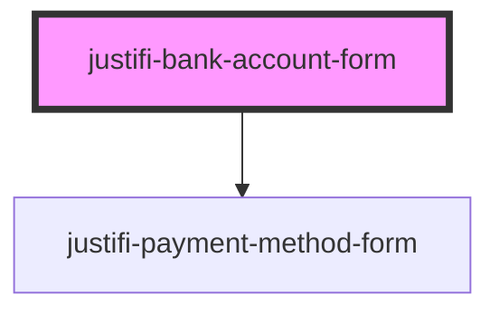

# justifi-bank-account-form

<!-- Auto Generated Below -->

## Properties

| Property         | Attribute         | Description | Type                                                           | Default     |
| ---------------- | ----------------- | ----------- | -------------------------------------------------------------- | ----------- |
| `iframeOrigin`   | `iframe-origin`   |             | `string`                                                       | `undefined` |
| `validationMode` | `validation-mode` |             | `"all" \| "onBlur" \| "onChange" \| "onSubmit" \| "onTouched"` | `undefined` |

## Events

| Event                     | Description                                                   | Type                          |
| ------------------------- | ------------------------------------------------------------- | ----------------------------- |
| `bankAccountFormReady`    |                                                               | `CustomEvent<any>`            |
| `bankAccountFormTokenize` |                                                               | `CustomEvent<{ data: any; }>` |
| `bankAccountFormValidate` | Triggered when the validate method is called on the component | `CustomEvent<any>`            |
| `ready`                   |                                                               | `CustomEvent<any>`            |

## Methods

### `resize() => Promise<void>`

#### Returns

Type: `Promise<void>`

### `tokenize(clientId: string, paymentMethodMetadata: any, account?: string) => Promise<CreatePaymentMethodResponse>`

#### Parameters

| Name   | Type                                                               | Description |
| ------ | ------------------------------------------------------------------ | ----------- |
| `args` | `[clientId: string, paymentMethodMetadata: any, account?: string]` |             |

#### Returns

Type: `Promise<CreatePaymentMethodResponse>`

### `validate() => Promise<any>`

Runs a validation on the form and shows errors if any

#### Returns

Type: `Promise<any>`

## Dependencies

### Depends on

- [justifi-payment-method-form](../payment-method-form)

### Graph

----------------------------------------------

*Built with [StencilJS](https://stenciljs.com/)*
