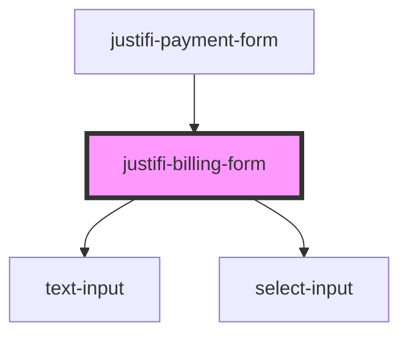

# justifi-billing-form

<!-- Auto Generated Below -->

## Properties

| Property | Attribute | Description                      | Type     | Default     |
| -------- | --------- | -------------------------------- | -------- | ----------- |
| `legend` | `legend`  | (Optional) A label for the form. | `string` | `undefined` |

## Methods

### `fill(fields: BillingFormFields) => Promise<void>`

Method for filling the form with provided data

#### Parameters

| Name     | Type                | Description                        |
| -------- | ------------------- | ---------------------------------- |
| `fields` | `BillingFormFields` | - The fields to fill the form with |

#### Returns

Type: `Promise<void>`

### `getValues() => Promise<BillingFormFields>`

Returns the values of the form as an object

#### Returns

Type: `Promise<BillingFormFields>`

The values of the form

### `validate() => Promise<{ isValid: boolean; }>`

Run validation on the form

#### Returns

Type: `Promise<{ isValid: boolean; }>`

## Dependencies

### Used by

 - [justifi-payment-form](../payment-form)

### Depends on

- [text-input](../text-input)
- [select-input](../select-input)

### Graph

----------------------------------------------

*Built with [StencilJS](https://stenciljs.com/)*
