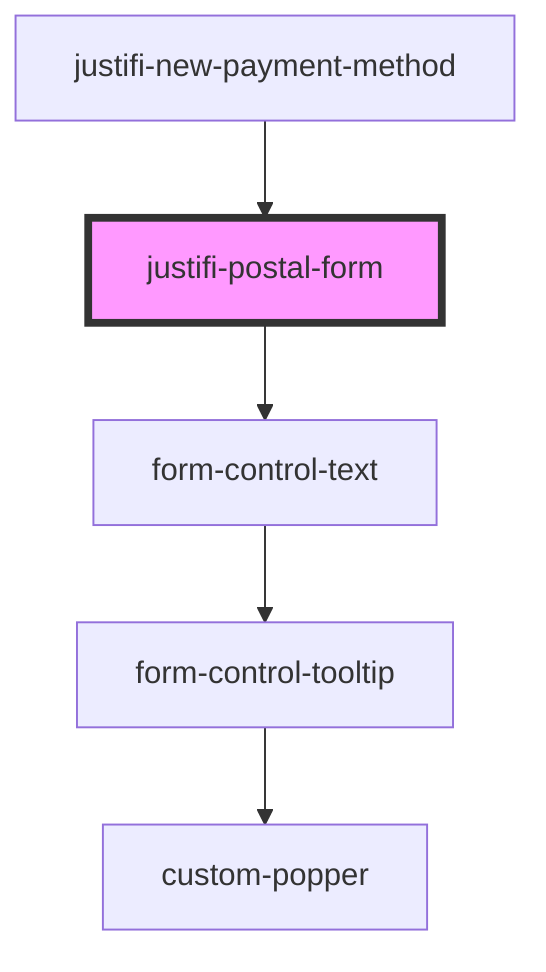

# justifi-billing-form

<!-- Auto Generated Below -->

## Properties

| Property | Attribute | Description                      | Type     | Default     |
| -------- | --------- | -------------------------------- | -------- | ----------- |
| `legend` | `legend`  | (Optional) A label for the form. | `string` | `undefined` |

## Methods

### `fill(fields: PostalFormFields) => Promise<void>`

#### Parameters

| Name     | Type               | Description |
| -------- | ------------------ | ----------- |
| `fields` | `PostalFormFields` |             |

#### Returns

Type: `Promise<void>`

### `getValues() => Promise<PostalFormFields>`

#### Returns

Type: `Promise<PostalFormFields>`

### `validate() => Promise<{ isValid: boolean; }>`

#### Returns

Type: `Promise<{ isValid: boolean; }>`

## Dependencies

### Used by

 - [justifi-new-payment-method](../checkout)

### Depends on

- [form-control-text](../../ui-components/form)

### Graph

----------------------------------------------

*Built with [StencilJS](https://stenciljs.com/)*
