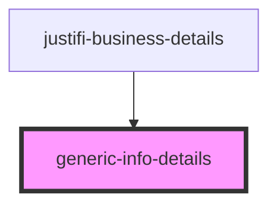

# generic-info-details

<!-- Auto Generated Below -->

## Properties

| Property   | Attribute | Description | Type        | Default     |
| ---------- | --------- | ----------- | ----------- | ----------- |
| `business` | --        |             | `IBusiness` | `undefined` |

## Dependencies

### Used by

 - [justifi-business-details](..)

### Graph

----------------------------------------------

*Built with [StencilJS](https://stenciljs.com/)*
