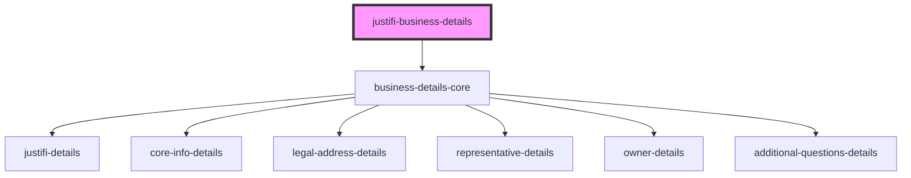

# justifi-business-details

<!-- Auto Generated Below -->

## Properties

| Property     | Attribute     | Description | Type     | Default     |
| ------------ | ------------- | ----------- | -------- | ----------- |
| `authToken`  | `auth-token`  |             | `string` | `undefined` |
| `businessId` | `business-id` |             | `string` | `undefined` |

## Events

| Event         | Description | Type                               |
| ------------- | ----------- | ---------------------------------- |
| `error-event` |             | `CustomEvent<ComponentErrorEvent>` |

## Dependencies

### Depends on

- [business-details-core](.)

### Graph

----------------------------------------------

*Built with [StencilJS](https://stenciljs.com/)*
