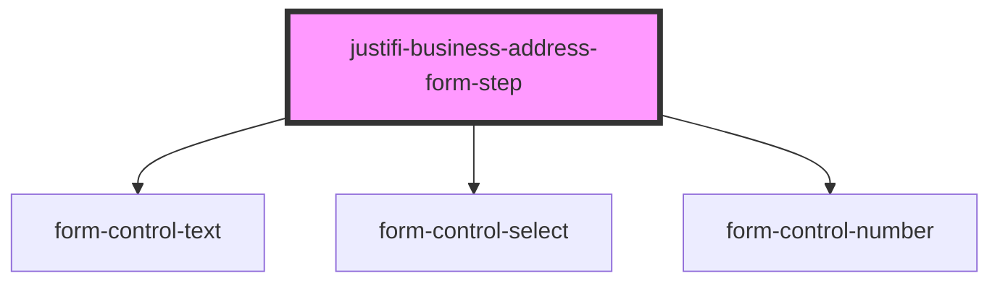

# justifi-business-address

<!-- Auto Generated Below -->

## Properties

| Property        | Attribute        | Description | Type                    | Default     |
| --------------- | ---------------- | ----------- | ----------------------- | ----------- |
| `defaultValues` | `default-values` |             | `any`                   | `undefined` |
| `errors`        | `errors`         |             | `any`                   | `undefined` |
| `onFormUpdate`  | --               |             | `(values: any) => void` | `undefined` |

## Dependencies

### Depends on

- [form-control-text](../../form)
- [form-control-select](../../form)
- [form-control-number](../../form)

### Graph

----------------------------------------------

*Built with [StencilJS](https://stenciljs.com/)*
