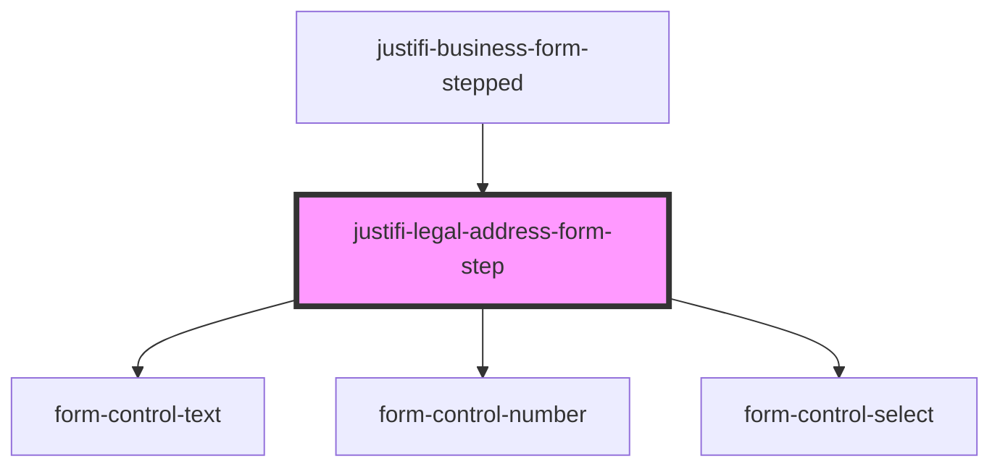

# legal-address-form

<!-- Auto Generated Below -->

## Properties

| Property     | Attribute     | Description | Type      | Default     |
| ------------ | ------------- | ----------- | --------- | ----------- |
| `authToken`  | `auth-token`  |             | `string`  | `undefined` |
| `businessId` | `business-id` |             | `string`  | `undefined` |
| `isLoading`  | `is-loading`  |             | `boolean` | `false`     |

## Events

| Event       | Description | Type                           |
| ----------- | ----------- | ------------------------------ |
| `submitted` |             | `CustomEvent<{ data?: any; }>` |

## Methods

### `validateAndSubmit(onSuccess: () => Promise<void>) => Promise<void>`

#### Parameters

| Name        | Type                  | Description |
| ----------- | --------------------- | ----------- |
| `onSuccess` | `() => Promise<void>` |             |

#### Returns

Type: `Promise<void>`

## Dependencies

### Used by

 - [justifi-business-form-stepped](..)

### Depends on

- [form-control-text](../../form)
- [form-control-number](../../form)
- [form-control-select](../../form)

### Graph

----------------------------------------------

*Built with [StencilJS](https://stenciljs.com/)*
