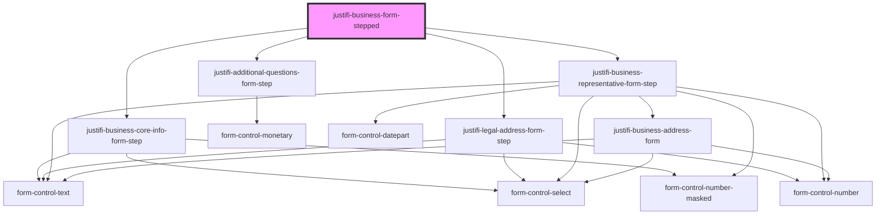

# justifi-business-info

<!-- Auto Generated Below -->

## Properties

| Property     | Attribute     | Description | Type      | Default     |
| ------------ | ------------- | ----------- | --------- | ----------- |
| `authToken`  | `auth-token`  |             | `string`  | `undefined` |
| `businessId` | `business-id` |             | `string`  | `undefined` |
| `hideErrors` | `hide-errors` |             | `boolean` | `false`     |
| `testMode`   | `test-mode`   |             | `boolean` | `false`     |

## Events

| Event        | Description | Type                                         |
| ------------ | ----------- | -------------------------------------------- |
| `clickEvent` |             | `CustomEvent<{ data?: any; name: string; }>` |

## Dependencies

### Depends on

- [justifi-business-core-info-form-step](business-core-info)
- [justifi-legal-address-form-step](legal-address-form)
- [justifi-additional-questions-form-step](additional-questions)
- [justifi-business-representative-form-step](business-representative)

### Graph

----------------------------------------------

*Built with [StencilJS](https://stenciljs.com/)*
