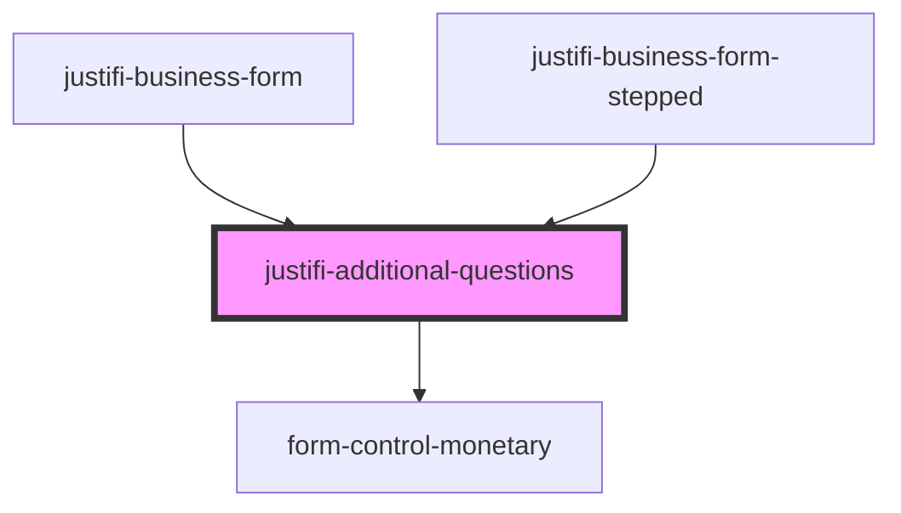

# justifi-additional-questions

<!-- Auto Generated Below -->

## Properties

| Property         | Attribute | Description | Type             | Default     |
| ---------------- | --------- | ----------- | ---------------- | ----------- |
| `formController` | --        |             | `FormController` | `undefined` |

## Dependencies

### Used by

 - [justifi-business-form](..)
 - [justifi-business-form-stepped](..)

### Depends on

- [form-control-monetary](../../form)

### Graph

----------------------------------------------

*Built with [StencilJS](https://stenciljs.com/)*
