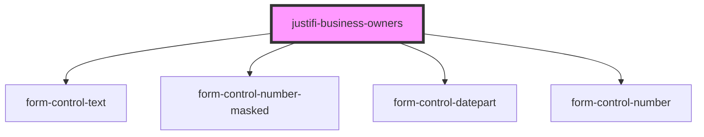

# justifi-business-owners

<!-- Auto Generated Below -->

## Properties

| Property         | Attribute | Description | Type             | Default     |
| ---------------- | --------- | ----------- | ---------------- | ----------- |
| `formController` | --        |             | `FormController` | `undefined` |

## Dependencies

### Depends on

- [form-control-text](../../form)
- [form-control-number-masked](../../form)
- [form-control-datepart](../../form)
- [form-control-number](../../form)

### Graph

----------------------------------------------

*Built with [StencilJS](https://stenciljs.com/)*
