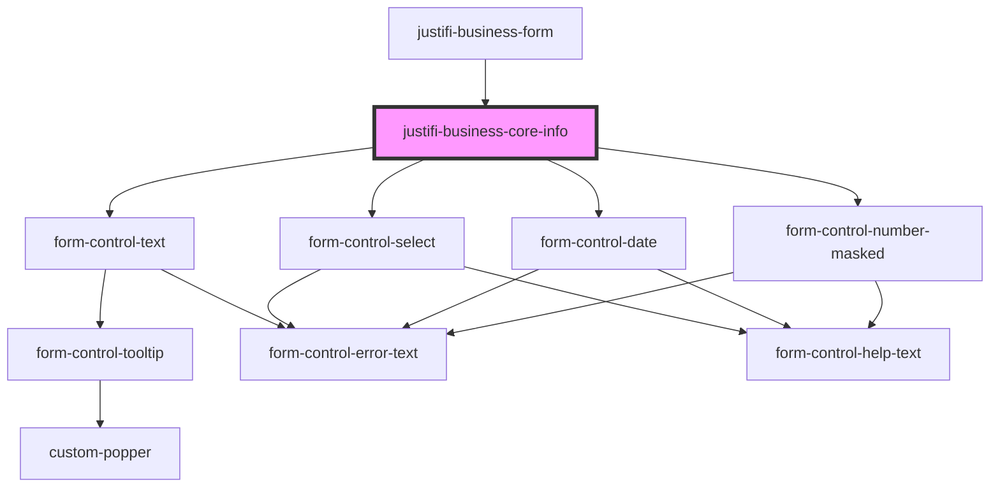

# justifi-business-generic-info-form

<!-- Auto Generated Below -->

## Overview

The difference between this component and business-core-info-details
is that this component is meant to be a form and send data
and the other one  is meant to be just read only.

## Properties

| Property         | Attribute | Description | Type             | Default     |
| ---------------- | --------- | ----------- | ---------------- | ----------- |
| `formController` | --        |             | `FormController` | `undefined` |

## Dependencies

### Used by

 - [justifi-business-form](..)

### Depends on

- [form-control-text](../../../form)
- [form-control-select](../../../form)
- [form-control-date](../../../form)
- [form-control-number-masked](../../../form)

### Graph

----------------------------------------------

*Built with [StencilJS](https://stenciljs.com/)*
