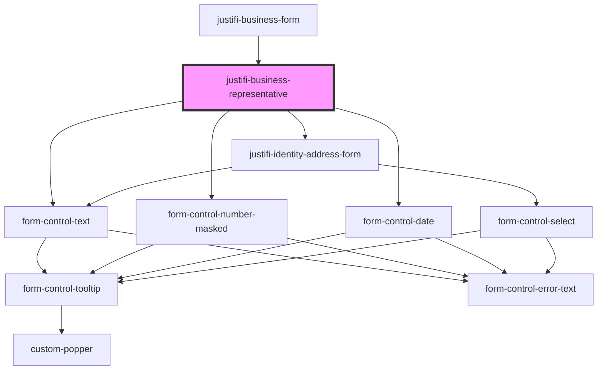

# justifi-business-representative

<!-- Auto Generated Below -->

## Properties

| Property         | Attribute         | Description | Type             | Default     |
| ---------------- | ----------------- | ----------- | ---------------- | ----------- |
| `formController` | `form-controller` |             | `FormController` | `undefined` |

## Dependencies

### Used by

 - [justifi-business-form](..)

### Depends on

- [form-control-text](../../../../ui-components/form)
- [form-control-number-masked](../../../../ui-components/form)
- [form-control-date](../../../../ui-components/form)
- [justifi-identity-address-form](../../owner-form/identity-address)

### Graph

----------------------------------------------

*Built with [StencilJS](https://stenciljs.com/)*
