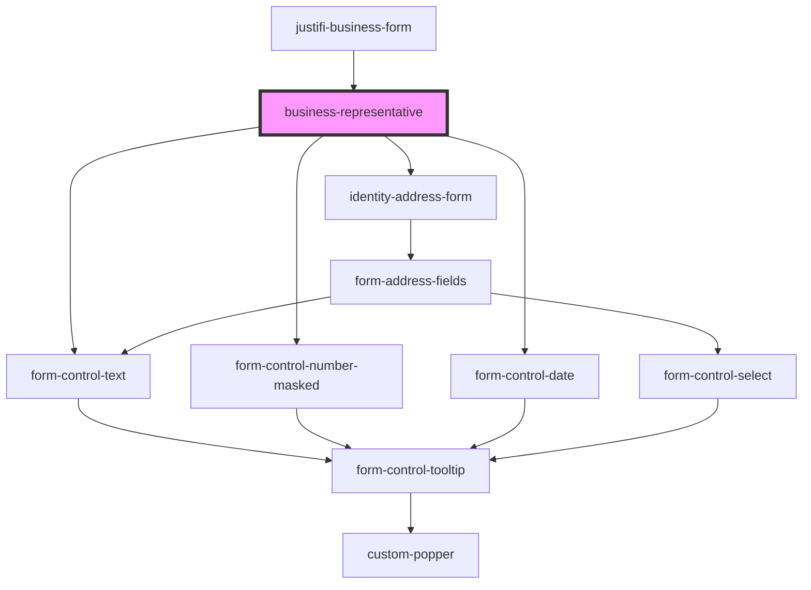

# justifi-business-representative

<!-- Auto Generated Below -->

## Properties

| Property                      | Attribute         | Description | Type                                 | Default     |
| ----------------------------- | ----------------- | ----------- | ------------------------------------ | ----------- |
| `country` _(required)_        | `country`         |             | `CountryCode.CAN \| CountryCode.USA` | `undefined` |
| `formController` _(required)_ | `form-controller` |             | `FormController`                     | `undefined` |

## Dependencies

### Used by

 - [justifi-business-form](..)

### Depends on

- [form-control-text](../../../../ui-components/form)
- [form-control-number-masked](../../../../ui-components/form)
- [form-control-date](../../../../ui-components/form)
- [identity-address-form](../../owner-form/identity-address)

### Graph

```mermaid
graph TD;
  business-representative --> form-control-text
  business-representative --> form-control-number-masked
  business-representative --> form-control-date
  business-representative --> identity-address-form
  form-control-text --> form-control-tooltip
  form-control-tooltip --> custom-popper
  form-control-number-masked --> form-control-tooltip
  form-control-date --> form-control-tooltip
  identity-address-form --> form-address-fields
  form-address-fields --> form-control-text
  form-address-fields --> form-control-select
  form-control-select --> form-control-tooltip
  justifi-business-form --> business-representative
  style business-representative fill:#f9f,stroke:#333,stroke-width:4px
```

----------------------------------------------

*Built with [StencilJS](https://stenciljs.com/)*
