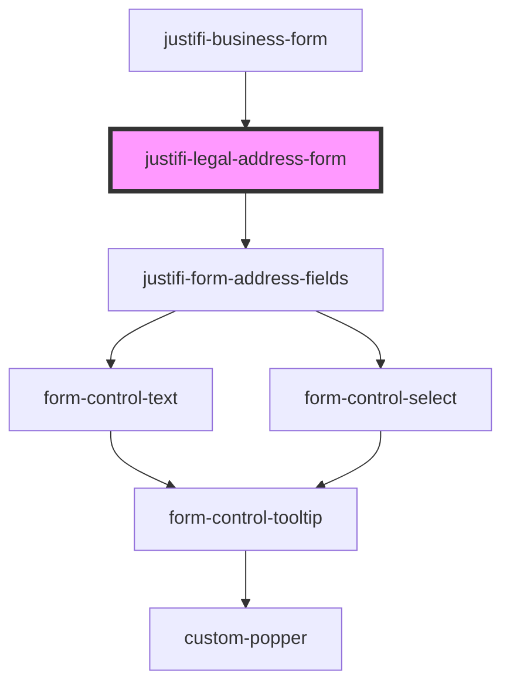

# legal-address-form

<!-- Auto Generated Below -->

## Properties

| Property         | Attribute         | Description | Type                                 | Default     |
| ---------------- | ----------------- | ----------- | ------------------------------------ | ----------- |
| `country`        | `country`         |             | `CountryCode.CAN \| CountryCode.USA` | `undefined` |
| `formController` | `form-controller` |             | `FormController`                     | `undefined` |

## Dependencies

### Used by

 - [justifi-business-form](..)

### Depends on

- [justifi-form-address-fields](../../payment-provisioning/form-address-fields)

### Graph

----------------------------------------------

*Built with [StencilJS](https://stenciljs.com/)*
