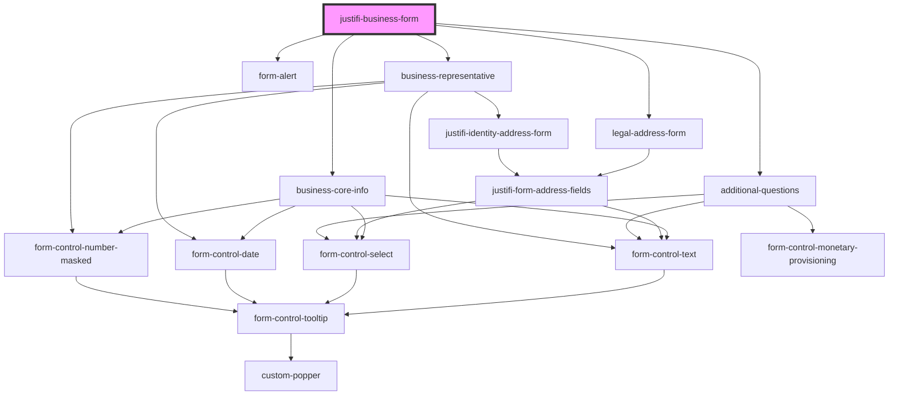

# justifi-business-info

<!-- Auto Generated Below -->

## Properties

| Property                  | Attribute      | Description | Type      | Default                  |
| ------------------------- | -------------- | ----------- | --------- | ------------------------ |
| `authToken` _(required)_  | `auth-token`   |             | `string`  | `undefined`              |
| `businessId` _(required)_ | `business-id`  |             | `string`  | `undefined`              |
| `formTitle`               | `form-title`   |             | `string`  | `'Business Information'` |
| `hideErrors`              | `hide-errors`  |             | `boolean` | `false`                  |
| `removeTitle`             | `remove-title` |             | `boolean` | `false`                  |

## Events

| Event          | Description | Type                                |
| -------------- | ----------- | ----------------------------------- |
| `click-event`  |             | `CustomEvent<ComponentClickEvent>`  |
| `error-event`  |             | `CustomEvent<ComponentErrorEvent>`  |
| `submit-event` |             | `CustomEvent<ComponentSubmitEvent>` |

## Dependencies

### Depends on

- [form-alert](../../../ui-components/form/form-helpers/form-alert)
- [business-core-info](business-core-info)
- [legal-address-form](legal-address-form)
- [additional-questions](additional-questions)
- [business-representative](business-representative)

### Graph

----------------------------------------------

*Built with [StencilJS](https://stenciljs.com/)*
