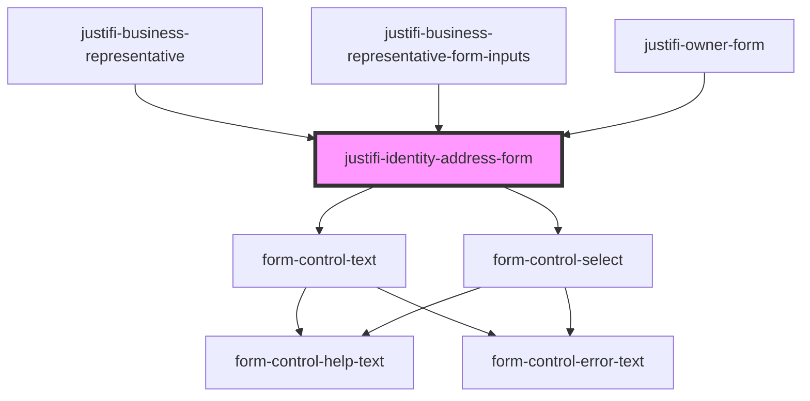

# justifi-business-address

<!-- Auto Generated Below -->

## Properties

| Property           | Attribute        | Description | Type                    | Default     |
| ------------------ | ---------------- | ----------- | ----------------------- | ----------- |
| `defaultValues`    | `default-values` |             | `any`                   | `undefined` |
| `errors`           | `errors`         |             | `any`                   | `undefined` |
| `handleFormUpdate` | --               |             | `(values: any) => void` | `undefined` |

## Dependencies

### Used by

 - [justifi-business-representative](../../business-form/business-representative)
 - [justifi-business-representative-form-inputs](../../payment-provisioning/business-representative)
 - [justifi-owner-form](..)

### Depends on

- [form-control-text](../../../form)
- [form-control-select](../../../form)

### Graph

----------------------------------------------

*Built with [StencilJS](https://stenciljs.com/)*
