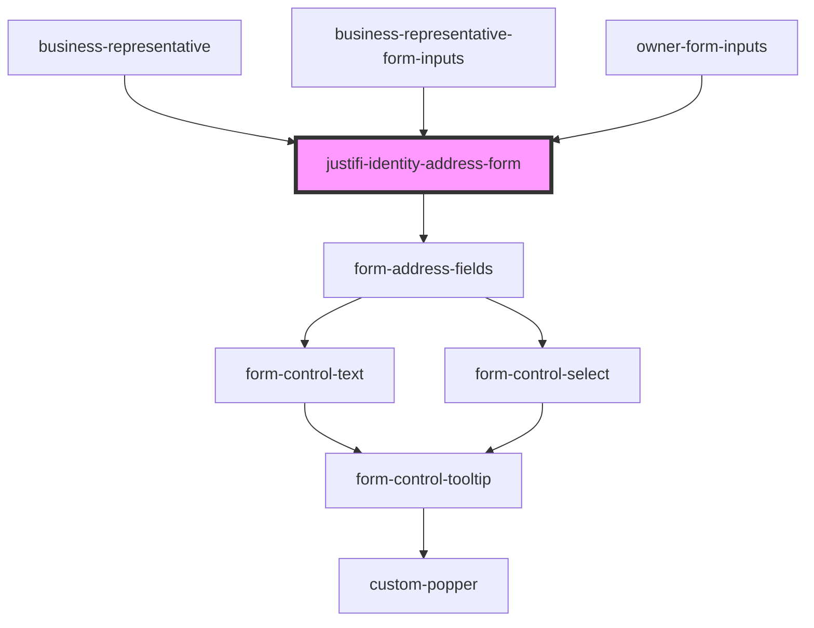

# justifi-business-address

<!-- Auto Generated Below -->

## Properties

| Property                        | Attribute        | Description | Type                                 | Default     |
| ------------------------------- | ---------------- | ----------- | ------------------------------------ | ----------- |
| `country` _(required)_          | `country`        |             | `CountryCode.CAN \| CountryCode.USA` | `undefined` |
| `defaultValues` _(required)_    | `default-values` |             | `any`                                | `undefined` |
| `errors` _(required)_           | `errors`         |             | `any`                                | `undefined` |
| `handleFormUpdate` _(required)_ | --               |             | `(values: any) => void`              | `undefined` |

## Dependencies

### Used by

 - [business-representative](../../business-form/business-representative)
 - [business-representative-form-inputs](../../payment-provisioning/business-representative)
 - [owner-form-inputs](..)

### Depends on

- [form-address-fields](../../payment-provisioning/form-address-fields)

### Graph

```mermaid
graph TD;
  justifi-identity-address-form --> form-address-fields
  form-address-fields --> form-control-text
  form-address-fields --> form-control-select
  form-control-text --> form-control-tooltip
  form-control-tooltip --> custom-popper
  form-control-select --> form-control-tooltip
  business-representative --> justifi-identity-address-form
  business-representative-form-inputs --> justifi-identity-address-form
  owner-form-inputs --> justifi-identity-address-form
  style justifi-identity-address-form fill:#f9f,stroke:#333,stroke-width:4px
```

----------------------------------------------

*Built with [StencilJS](https://stenciljs.com/)*
