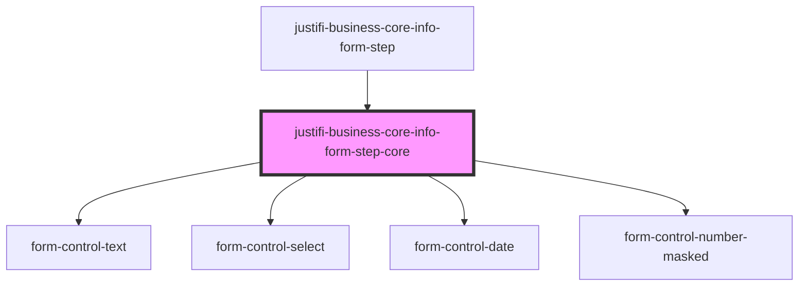

# justifi-business-generic-info-form

<!-- Auto Generated Below -->

## Properties

| Property              | Attribute               | Description | Type       | Default     |
| --------------------- | ----------------------- | ----------- | ---------- | ----------- |
| `allowOptionalFields` | `allow-optional-fields` |             | `boolean`  | `undefined` |
| `businessId`          | `business-id`           |             | `string`   | `undefined` |
| `getBusiness`         | --                      |             | `Function` | `undefined` |
| `patchBusiness`       | --                      |             | `Function` | `undefined` |

## Events

| Event         | Description | Type                                   |
| ------------- | ----------- | -------------------------------------- |
| `error-event` |             | `CustomEvent<ComponentError>`          |
| `formLoading` |             | `CustomEvent<boolean>`                 |
| `submitted`   |             | `CustomEvent<BusinessFormSubmitEvent>` |

## Methods

### `validateAndSubmit({ onSuccess }: { onSuccess: any; }) => Promise<void>`

#### Parameters

| Name  | Type                  | Description |
| ----- | --------------------- | ----------- |
| `__0` | `{ onSuccess: any; }` |             |

#### Returns

Type: `Promise<void>`

## Dependencies

### Used by

 - [justifi-business-core-info-form-step](.)

### Depends on

- [form-control-text](../../../../ui-components/form)
- [form-control-select](../../../../ui-components/form)
- [form-control-date](../../../../ui-components/form)
- [form-control-number-masked](../../../../ui-components/form)

### Graph

----------------------------------------------

*Built with [StencilJS](https://stenciljs.com/)*
