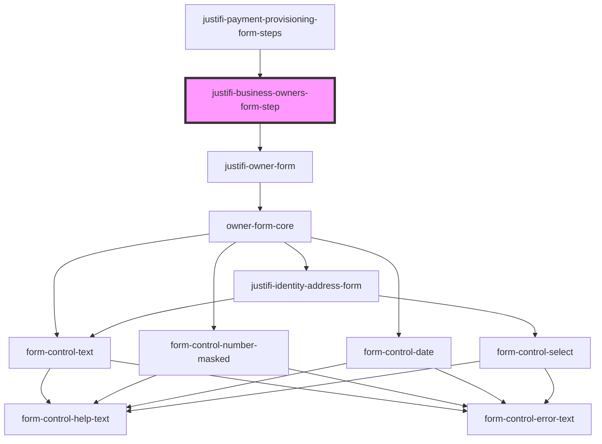

# justifi-business-owners

<!-- Auto Generated Below -->

## Properties

| Property              | Attribute               | Description | Type      | Default     |
| --------------------- | ----------------------- | ----------- | --------- | ----------- |
| `allowOptionalFields` | `allow-optional-fields` |             | `boolean` | `undefined` |
| `authToken`           | `auth-token`            |             | `string`  | `undefined` |
| `businessId`          | `business-id`           |             | `string`  | `undefined` |

## Events

| Event         | Description | Type                                   |
| ------------- | ----------- | -------------------------------------- |
| `click-event` |             | `CustomEvent<BusinessFormClickEvent>`  |
| `error-event` |             | `CustomEvent<ComponentError>`          |
| `formLoading` |             | `CustomEvent<boolean>`                 |
| `submitted`   |             | `CustomEvent<BusinessFormSubmitEvent>` |

## Methods

### `validateAndSubmit({ onSuccess }: { onSuccess: any; }) => Promise<void>`

#### Parameters

| Name  | Type                  | Description |
| ----- | --------------------- | ----------- |
| `__0` | `{ onSuccess: any; }` |             |

#### Returns

Type: `Promise<void>`

## Dependencies

### Used by

 - [justifi-payment-provisioning-form-steps](..)

### Depends on

- [justifi-owner-form](../../owner-form)

### Graph

----------------------------------------------

*Built with [StencilJS](https://stenciljs.com/)*
