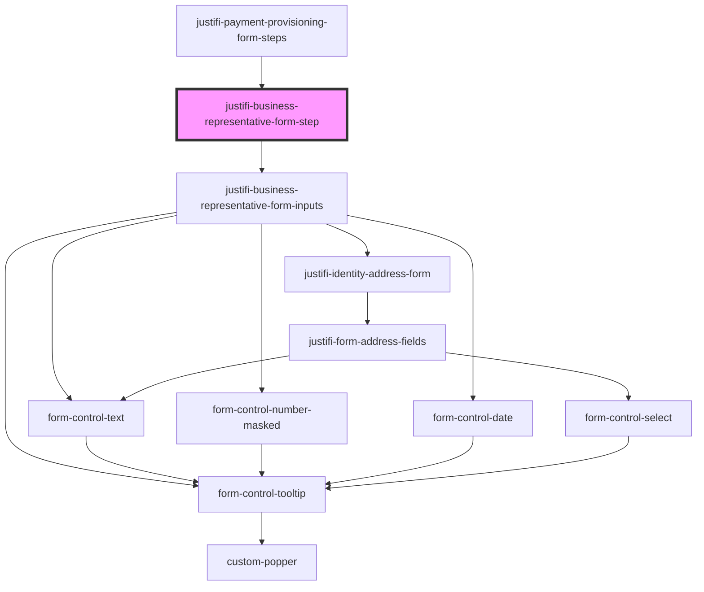

# justifi-business-representative

<!-- Auto Generated Below -->

## Properties

| Property              | Attribute               | Description | Type                                 | Default     |
| --------------------- | ----------------------- | ----------- | ------------------------------------ | ----------- |
| `allowOptionalFields` | `allow-optional-fields` |             | `boolean`                            | `undefined` |
| `authToken`           | `auth-token`            |             | `string`                             | `undefined` |
| `businessId`          | `business-id`           |             | `string`                             | `undefined` |
| `country`             | `country`               |             | `CountryCode.CAN \| CountryCode.USA` | `undefined` |

## Events

| Event                      | Description | Type                                          |
| -------------------------- | ----------- | --------------------------------------------- |
| `complete-form-step-event` |             | `CustomEvent<ComponentFormStepCompleteEvent>` |
| `error-event`              |             | `CustomEvent<ComponentErrorEvent>`            |
| `formLoading`              |             | `CustomEvent<boolean>`                        |

## Methods

### `validateAndSubmit({ onSuccess }: { onSuccess: any; }) => Promise<void>`

#### Parameters

| Name  | Type                  | Description |
| ----- | --------------------- | ----------- |
| `__0` | `{ onSuccess: any; }` |             |

#### Returns

Type: `Promise<void>`

## Dependencies

### Used by

 - [justifi-payment-provisioning-form-steps](..)

### Depends on

- [justifi-business-representative-form-inputs](.)

### Graph

----------------------------------------------

*Built with [StencilJS](https://stenciljs.com/)*
