# justifi-business-info

<!-- Auto Generated Below -->

## Properties

| Property              | Attribute               | Description | Type                            | Default     |
| --------------------- | ----------------------- | ----------- | ------------------------------- | ----------- |
| `allowOptionalFields` | `allow-optional-fields` |             | `boolean`                       | `false`     |
| `authToken`           | `auth-token`            |             | `string`                        | `undefined` |
| `businessId`          | `business-id`           |             | `string`                        | `undefined` |
| `currentStep`         | `current-step`          |             | `number`                        | `undefined` |
| `handleFormLoading`   | --                      |             | `(e: CustomEvent<any>) => void` | `undefined` |
| `refs`                | --                      |             | `any[]`                         | `undefined` |

## Events

| Event           | Description | Type               |
| --------------- | ----------- | ------------------ |
| `formCompleted` |             | `CustomEvent<any>` |

## Dependencies

### Used by

 - [justifi-payment-provisioning-core](.)

### Depends on

- [justifi-business-core-info-form-step](business-core-info)
- [justifi-legal-address-form-step](legal-address-form)
- [justifi-additional-questions-form-step](additional-questions)
- [justifi-business-representative-form-step](business-representative)
- [justifi-business-owners-form-step](business-owners)
- [justifi-business-bank-account-form-step](bank-account)
- [justifi-business-document-upload-form-step](document-uploads)
- [justifi-business-terms-conditions-form-step](terms-and-conditions)

### Graph

```mermaid
graph TD;
  justifi-payment-provisioning-form-steps --> justifi-business-core-info-form-step
  justifi-payment-provisioning-form-steps --> justifi-legal-address-form-step
  justifi-payment-provisioning-form-steps --> justifi-additional-questions-form-step
  justifi-payment-provisioning-form-steps --> justifi-business-representative-form-step
  justifi-payment-provisioning-form-steps --> justifi-business-owners-form-step
  justifi-payment-provisioning-form-steps --> justifi-business-bank-account-form-step
  justifi-payment-provisioning-form-steps --> justifi-business-document-upload-form-step
  justifi-payment-provisioning-form-steps --> justifi-business-terms-conditions-form-step
  justifi-business-core-info-form-step --> justifi-business-core-info-form-step-core
  justifi-business-core-info-form-step-core --> form-control-text
  justifi-business-core-info-form-step-core --> form-control-select
  justifi-business-core-info-form-step-core --> form-control-date
  justifi-business-core-info-form-step-core --> form-control-number-masked
  form-control-text --> form-control-tooltip
  form-control-text --> form-control-error-text
  form-control-tooltip --> custom-popper
  form-control-select --> form-control-help-text
  form-control-select --> form-control-error-text
  form-control-date --> form-control-help-text
  form-control-date --> form-control-error-text
  form-control-number-masked --> form-control-help-text
  form-control-number-masked --> form-control-error-text
  justifi-legal-address-form-step --> justifi-legal-address-form-step-core
  justifi-legal-address-form-step-core --> form-control-text
  justifi-legal-address-form-step-core --> form-control-select
  justifi-additional-questions-form-step --> justifi-additional-questions-form-step-core
  justifi-additional-questions-form-step-core --> form-control-monetary
  justifi-additional-questions-form-step-core --> form-control-select
  justifi-additional-questions-form-step-core --> form-control-text
  form-control-monetary --> form-control-help-text
  form-control-monetary --> form-control-error-text
  justifi-business-representative-form-step --> justifi-business-representative-form-step-core
  justifi-business-representative-form-step-core --> justifi-business-representative-form-inputs
  justifi-business-representative-form-inputs --> form-control-text
  justifi-business-representative-form-inputs --> form-control-number-masked
  justifi-business-representative-form-inputs --> form-control-date
  justifi-business-representative-form-inputs --> justifi-identity-address-form
  justifi-identity-address-form --> form-control-text
  justifi-identity-address-form --> form-control-select
  justifi-business-owners-form-step --> justifi-business-owners-form-step-core
  justifi-business-owners-form-step-core --> justifi-owner-form
  justifi-owner-form --> owner-form-core
  owner-form-core --> owner-form-inputs
  owner-form-inputs --> form-control-text
  owner-form-inputs --> form-control-number-masked
  owner-form-inputs --> form-control-date
  owner-form-inputs --> justifi-identity-address-form
  justifi-business-bank-account-form-step --> form-control-text
  justifi-business-bank-account-form-step --> form-control-select
  justifi-business-document-upload-form-step --> justifi-business-documents-on-file
  justifi-business-document-upload-form-step --> justifi-business-document-upload-input-group
  justifi-business-document-upload-input-group --> form-control-file
  form-control-file --> form-control-help-text
  form-control-file --> form-control-error-text
  justifi-business-terms-conditions-form-step --> justifi-business-terms-conditions-text
  justifi-business-terms-conditions-form-step --> form-control-checkbox
  form-control-checkbox --> form-control-help-text
  form-control-checkbox --> form-control-error-text
  justifi-payment-provisioning-core --> justifi-payment-provisioning-form-steps
  style justifi-payment-provisioning-form-steps fill:#f9f,stroke:#333,stroke-width:4px
```

----------------------------------------------

*Built with [StencilJS](https://stenciljs.com/)*
