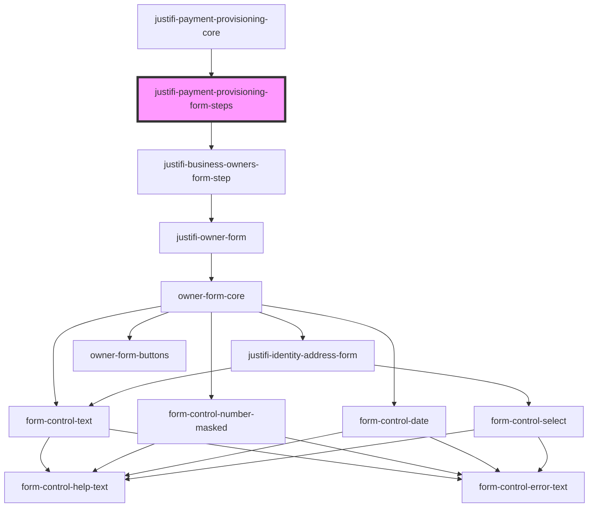

# justifi-business-info

<!-- Auto Generated Below -->

## Properties

| Property              | Attribute               | Description | Type                            | Default     |
| --------------------- | ----------------------- | ----------- | ------------------------------- | ----------- |
| `allowOptionalFields` | `allow-optional-fields` |             | `boolean`                       | `false`     |
| `authToken`           | `auth-token`            |             | `string`                        | `undefined` |
| `businessId`          | `business-id`           |             | `string`                        | `undefined` |
| `currentStep`         | `current-step`          |             | `number`                        | `undefined` |
| `handleFormLoading`   | --                      |             | `(e: CustomEvent<any>) => void` | `undefined` |
| `refs`                | --                      |             | `any[]`                         | `undefined` |

## Events

| Event           | Description | Type               |
| --------------- | ----------- | ------------------ |
| `formCompleted` |             | `CustomEvent<any>` |

## Dependencies

### Used by

 - [justifi-payment-provisioning-core](.)

### Depends on

- [justifi-business-owners-form-step](business-owners)

### Graph

----------------------------------------------

*Built with [StencilJS](https://stenciljs.com/)*
