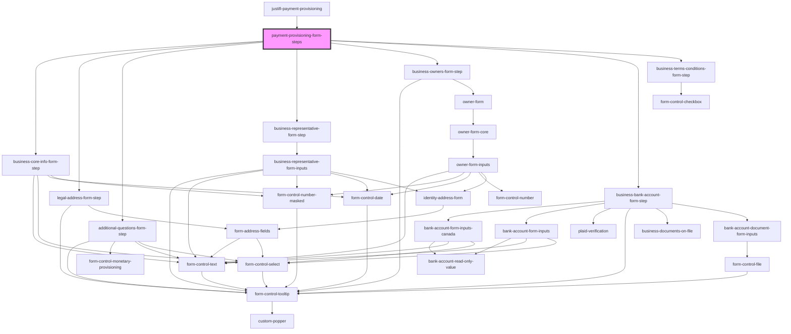

# justifi-payment-provisioning

## Country Support

This component supports both USA and CAN (Canada) countries. The country is determined by the `country_of_establishment` field on the Business entity.

### Country-Specific Behavior

| Feature              | USA                 | CAN                   |
| -------------------- | ------------------- | --------------------- |
| State/Province label | State               | Province              |
| Postal code          | Zip Code (5 digits) | Postal Code (A1A 1A1) |
| Identity number      | SSN (xxx-xx-xxxx)   | SIN (xxx-xxx-xxx)     |
| Tax identifier       | Tax ID              | Business Number (BN)  |
| Bank account fields  | USA-specific        | CAN-specific          |

### Important Constraint

The `country` prop must only be defaulted in `justifi-payment-provisioning`. Child components must receive `country` via props and must NOT fall back to a default locally.

<!-- Auto Generated Below -->

## Properties

| Property                         | Attribute               | Description | Type                                 | Default           |
| -------------------------------- | ----------------------- | ----------- | ------------------------------------ | ----------------- |
| `allowOptionalFields`            | `allow-optional-fields` |             | `boolean`                            | `false`           |
| `authToken` _(required)_         | `auth-token`            |             | `string`                             | `undefined`       |
| `businessId` _(required)_        | `business-id`           |             | `string`                             | `undefined`       |
| `country`                        | `country`               |             | `CountryCode.CAN \| CountryCode.USA` | `CountryCode.USA` |
| `currentStep` _(required)_       | `current-step`          |             | `number`                             | `undefined`       |
| `handleFormLoading` _(required)_ | --                      |             | `(e: CustomEvent<any>) => void`      | `undefined`       |
| `refs` _(required)_              | --                      |             | `any[]`                              | `undefined`       |

## Dependencies

### Used by

 - [justifi-payment-provisioning](.)

### Depends on

- [business-core-info-form-step](business-core-info)
- [legal-address-form-step](legal-address-form)
- [additional-questions-form-step](additional-questions)
- [business-representative-form-step](business-representative)
- [business-owners-form-step](business-owners)
- [business-bank-account-form-step](bank-account)
- [business-terms-conditions-form-step](terms-and-conditions)

### Graph

```mermaid
graph TD;
  payment-provisioning-form-steps --> business-core-info-form-step
  payment-provisioning-form-steps --> legal-address-form-step
  payment-provisioning-form-steps --> additional-questions-form-step
  payment-provisioning-form-steps --> business-representative-form-step
  payment-provisioning-form-steps --> business-owners-form-step
  payment-provisioning-form-steps --> business-bank-account-form-step
  payment-provisioning-form-steps --> business-terms-conditions-form-step
  business-core-info-form-step --> form-control-text
  business-core-info-form-step --> form-control-select
  business-core-info-form-step --> form-control-date
  business-core-info-form-step --> form-control-number-masked
  form-control-text --> form-control-tooltip
  form-control-tooltip --> custom-popper
  form-control-select --> form-control-tooltip
  form-control-date --> form-control-tooltip
  form-control-number-masked --> form-control-tooltip
  legal-address-form-step --> form-control-tooltip
  legal-address-form-step --> form-address-fields
  form-address-fields --> form-control-text
  form-address-fields --> form-control-select
  additional-questions-form-step --> form-control-tooltip
  additional-questions-form-step --> form-control-monetary-provisioning
  additional-questions-form-step --> form-control-text
  additional-questions-form-step --> form-control-select
  business-representative-form-step --> business-representative-form-inputs
  business-representative-form-inputs --> form-control-tooltip
  business-representative-form-inputs --> form-control-text
  business-representative-form-inputs --> form-control-number-masked
  business-representative-form-inputs --> form-control-date
  business-representative-form-inputs --> identity-address-form
  identity-address-form --> form-address-fields
  business-owners-form-step --> form-control-tooltip
  business-owners-form-step --> owner-form
  owner-form --> owner-form-core
  owner-form-core --> owner-form-inputs
  owner-form-inputs --> form-control-text
  owner-form-inputs --> form-control-number-masked
  owner-form-inputs --> form-control-date
  owner-form-inputs --> form-control-number
  owner-form-inputs --> identity-address-form
  business-bank-account-form-step --> bank-account-form-inputs-canada
  business-bank-account-form-step --> bank-account-form-inputs
  business-bank-account-form-step --> plaid-verification
  business-bank-account-form-step --> form-control-tooltip
  business-bank-account-form-step --> business-documents-on-file
  business-bank-account-form-step --> bank-account-document-form-inputs
  bank-account-form-inputs-canada --> bank-account-read-only-value
  bank-account-form-inputs-canada --> form-control-text
  bank-account-form-inputs-canada --> form-control-select
  bank-account-form-inputs --> bank-account-read-only-value
  bank-account-form-inputs --> form-control-text
  bank-account-form-inputs --> form-control-select
  bank-account-document-form-inputs --> form-control-file
  form-control-file --> form-control-tooltip
  business-terms-conditions-form-step --> form-control-checkbox
  justifi-payment-provisioning --> payment-provisioning-form-steps
  style payment-provisioning-form-steps fill:#f9f,stroke:#333,stroke-width:4px
```

----------------------------------------------

*Built with [StencilJS](https://stenciljs.com/)*
