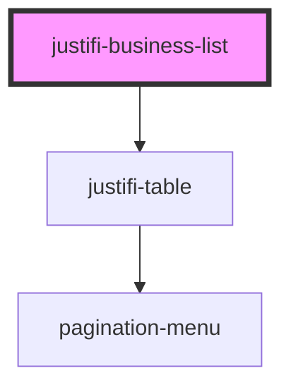

# justifi-business-list

<!-- Auto Generated Below -->

## Properties

| Property    | Attribute    | Description                                                           | Type     | Default     |
| ----------- | ------------ | --------------------------------------------------------------------- | -------- | ----------- |
| `accountId` | `account-id` | The Account ID to fetch payments. This is required to fetch any data. | `string` | `undefined` |
| `authToken` | `auth-token` | The Auth Token to fetch payments. This is required to fetch any data. | `string` | `undefined` |

## Dependencies

### Depends on

- [justifi-table](../table)

### Graph

----------------------------------------------

*Built with [StencilJS](https://stenciljs.com/)*
