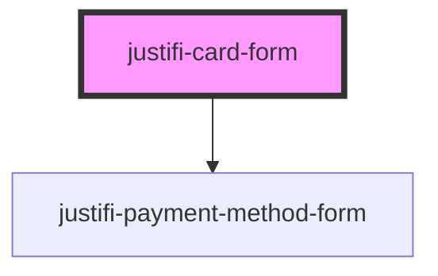

<h1>
  <code><justifi-card-form /></code>
</h1>

---

## Example usage

<details>
  <summary>Show Examples</summary>

```html
<!DOCTYPE html>
<html dir="ltr" lang="en">
  <head>
    <meta charset="utf-8" />
    <meta name="viewport" content="width=device-width, initial-scale=1.0, minimum-scale=1.0, maximum-scale=5.0" />
    <title>justifi-card-form: Simple example</title>

    <!--
    If you are including the components via CDN the src should be the following:
    https://cdn.jsdelivr.net/npm/@justifi/webcomponents@2.1.0/dist/webcomponents/webcomponents.esm.js
  -->
    <script type="module" src="/build/webcomponents.esm.js"></script>
    <script nomodule src="/build/webcomponents.js"></script>
  </head>

  <body>
    <h1>Card Form</h1>
    <hr />
    <!--
    The 'style-overrides' prop takes a stringified instance of Theme. The type and all optional
    members for Theme can be found here:
    https://github.com/justifi-tech/web-component-library/tree/main/stencil-library/src/components/payment-method-form/theme.ts
  -->
    <justifi-card-form
      style-overrides='{
    "layout":{
      "padding":"0",
      "formControlSpacingHorizontal":".5rem",
      "formControlSpacingVertical":"1rem"
    },
    "formLabel":{
      "fontWeight":700,
      "fontFamily":"sans-serif",
      "margin":"0 0 .5rem 0"
    },
    "formControl":{
      "backgroundColor":"#F4F4F6",
      "backgroundColorHover":"#EEEEF5",
      "borderColor":"rgba(0, 0, 0, 0.42)",
      "borderColorHover":"rgba(0, 0, 0, 0.62)",
      "borderColorFocus":"#fccc32",
      "borderColorError":"#C12727",
      "borderWidth":"0px",
      "borderBottomWidth":"1px",
      "borderRadius":"4px 4px 0 0",
      "borderStyle":"solid",
      "boxShadowErrorFocus":"none",
      "boxShadowFocus":"none",
      "color":"#212529",
      "fontSize":"1rem",
      "fontWeight":"400",
      "lineHeight":"2",
      "margin":"0",
      "padding":".5rem .875rem"
    },
    "errorMessage":{
      "color":"#C12727",
      "margin":".25rem 0 0 0",
      "fontSize":".875rem"
    }
  }'
    ></justifi-card-form>
    <button type="submit" id="card-submit-button">Tokenize</button>
    <button type="submit" id="card-validate-button">Validate</button>
  </body>

  <script>
    (function () {
      var cardForm = document.querySelector('justifi-card-form');
      var cardSubmitButton = document.querySelector('#card-submit-button');
      var cardValidateButton = document.querySelector('#card-validate-button');
      cardForm.addEventListener('cardFormReady', function () {
        console.log('justifi-card-form ready');
      });
      cardSubmitButton.addEventListener('click', event => {
        console.log('card form tokenize button clicked');
        // All of this information would come from your form instead of being hard coded
        // Card number, expiration and cvv are collected on our iframe
        const paymentMethodData = {
          name: 'John Doe',
          address_line1: '123 Broadway', // optional
          address_line2: '', // optional
          address_city: 'Minneapolis', // optional
          address_state: 'MN', // optional
          address_postal_code: '55413',
          address_country: 'US', // optional
          metadata: { something: 'somevalue' }, // optional
        };
        // ACCOUNT_ID is optional, currently required for platforms
        // CLIENT_ID is the seller account for which you are tokenizing
        cardForm.tokenize('CLIENT_ID', paymentMethodData, 'ACCOUNT_ID').then(data => {
          // This is where you can submit the form and use the payment method token
          // on your backend
          console.log('justifi-card-form tokenized: ', data);
        });
      });
      cardValidateButton.addEventListener('click', event => {
        console.log('card validate button clicked');
        cardForm.validate().then(data => {
          console.log('justifi-card-form validated. Is valid? ', data.isValid);
        });
      });
    })();
  </script>
</html>
```

</details>

---

## Styling

The `style-overrides` attribute below requires type `string`, but should be a stringified [`Theme`](https://github.com/justifi-tech/web-component-library/tree/main/stencil-library/src/components/payment-method-form/theme.ts)

<!-- Auto Generated Below -->


## Properties

| Property         | Attribute         | Description                                                        | Type                                                           | Default               |
| ---------------- | ----------------- | ------------------------------------------------------------------ | -------------------------------------------------------------- | --------------------- |
| `iframeOrigin`   | `iframe-origin`   | URL for the rendered iFrame. End-users need not use this.          | `string`                                                       | `config.iframeOrigin` |
| `singleLine`     | `single-line`     | Boolean indicating if the Card Form should render in a single line | `boolean`                                                      | `false`               |
| `validationMode` | `validation-mode` | When to trigger validation of the form.                            | `"all" \| "onBlur" \| "onChange" \| "onSubmit" \| "onTouched"` | `undefined`           |


## Events

| Event              | Description                                                   | Type                                            |
| ------------------ | ------------------------------------------------------------- | ----------------------------------------------- |
| `cardFormReady`    | Triggered when iframe has loaded                              | `CustomEvent<any>`                              |
| `cardFormTokenize` | Triggered when the tokenize method is called on the component | `CustomEvent<{ data: any; }>`                   |
| `cardFormValidate` | Triggered when the validate method is called on the component | `CustomEvent<{ data: { isValid: boolean; }; }>` |
| `ready`            | Triggered when iframe has loaded                              | `CustomEvent<any>`                              |


## Methods

### `resize() => Promise<void>`

<span style="color:red">**[DEPRECATED]**</span> This method will be removed in future releases.<br/><br/>Manually resizes the iframe to fit the contents of the iframe

#### Returns

Type: `Promise<void>`


### `tokenize(clientId: string, paymentMethodMetadata: any, account?: string) => Promise<CreatePaymentMethodResponse>`

Makes a tokenization request to the iframe

#### Parameters

| Name   | Type                                                               | Description |
| ------ | ------------------------------------------------------------------ | ----------- |
| `args` | `[clientId: string, paymentMethodMetadata: any, account?: string]` |             |

#### Returns

Type: `Promise<CreatePaymentMethodResponse>`


### `validate() => Promise<{ isValid: boolean; }>`

Runs a validation on the form and shows errors if any

#### Returns

Type: `Promise<{ isValid: boolean; }>`


## Dependencies

### Depends on

- [justifi-payment-method-form](../payment-method-form)

### Graph


----------------------------------------------

*Built with [StencilJS](https://stenciljs.com/)*
