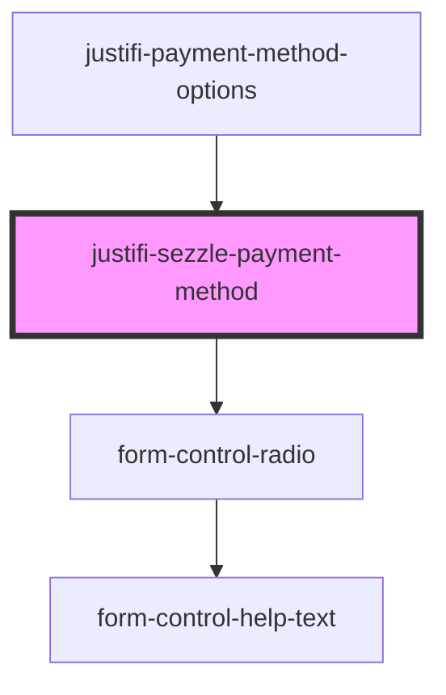

<h1>
  <code><justifi-payment-form /></code>
</h1>

## Examples

```html
<!doctype html>
<html dir="ltr" lang="en">
  <head>
    <meta charset="utf-8" />
    <meta
      name="viewport"
      content="width=device-width, initial-scale=1.0, minimum-scale=1.0, maximum-scale=5.0"
    />
    <title>justifi-payment-form: Simple example</title>

    <!--
    If you are including the components via CDN the src should be the following:
    https://cdn.jsdelivr.net/npm/@justifi/webcomponents@2.1.0/dist/webcomponents/webcomponents.esm.js
  -->
    <script type="module" src="/build/webcomponents.esm.js"></script>
    <script nomodule src="/build/webcomponents.js"></script>
  </head>

  <body>
    <h1>PaymentForm</h1>
    <hr />
    <justifi-payment-form></justifi-payment-form>
  </body>

  <script>
    (function () {})();
  </script>
</html>
```

<!-- Auto Generated Below -->


## Properties

| Property              | Attribute        | Description | Type                  | Default               |
| --------------------- | ---------------- | ----------- | --------------------- | --------------------- |
| `accountId`           | `account-id`     |             | `string`              | `undefined`           |
| `bnpl`                | `bnpl`           |             | `any`                 | `undefined`           |
| `clientId`            | `client-id`      |             | `string`              | `undefined`           |
| `iframeOrigin`        | `iframe-origin`  |             | `string`              | `config.iframeOrigin` |
| `isSelected`          | `is-selected`    |             | `boolean`             | `undefined`           |
| `paymentAmount`       | `payment-amount` |             | `number`              | `undefined`           |
| `paymentMethodOption` | --               |             | `PaymentMethodOption` | `undefined`           |


## Events

| Event                         | Description | Type               |
| ----------------------------- | ----------- | ------------------ |
| `paymentMethodOptionSelected` |             | `CustomEvent<any>` |


## Methods

### `resolvePaymentMethod(insuranceValidation: any) => Promise<PaymentMethodPayload>`


#### Parameters

| Name                  | Type  | Description |
| --------------------- | ----- | ----------- |
| `insuranceValidation` | `any` |             |

#### Returns

Type: `Promise<PaymentMethodPayload>`


## Shadow Parts

| Part                | Description |
| ------------------- | ----------- |
| `"radio-list-item"` |             |


## Dependencies

### Used by

 - [justifi-payment-method-options](.)

### Depends on

- [form-control-radio](../../ui-components/form)

### Graph


----------------------------------------------

*Built with [StencilJS](https://stenciljs.com/)*
