# form-control-text

<!-- Auto Generated Below -->

## Properties

| Property       | Attribute       | Description | Type                                    | Default     |
| -------------- | --------------- | ----------- | --------------------------------------- | ----------- |
| `defaultValue` | `default-value` |             | `string`                                | `undefined` |
| `disabled`     | `disabled`      |             | `boolean`                               | `undefined` |
| `error`        | `error`         |             | `string`                                | `undefined` |
| `inputHandler` | --              |             | `(name: string, value: string) => void` | `undefined` |
| `label`        | `label`         |             | `string`                                | `undefined` |
| `name`         | `name`          |             | `any`                                   | `undefined` |

## Events

| Event              | Description | Type               |
| ------------------ | ----------- | ------------------ |
| `formControlBlur`  |             | `CustomEvent<any>` |
| `formControlInput` |             | `CustomEvent<any>` |

## Shadow Parts

| Part      | Description |
| --------- | ----------- |
| `"label"` |             |

## Dependencies

### Used by

 - [justifi-business-address-form](../business-form/business-address)
 - [justifi-business-address-form-step](../business-form-stepped/business-address)
 - [justifi-business-core-info-form-step](../business-form-stepped/business-core-info)
 - [justifi-business-generic-info](../business-form/business-generic-info)
 - [justifi-business-owners](../business-form/business-owners)
 - [justifi-business-owners-form-step](../business-form-stepped/business-owners)
 - [justifi-business-representative](../business-form/business-representative)
 - [justifi-business-representative-form-step](../business-form-stepped/business-representative)
 - [justifi-legal-address-form](../business-form/legal-address-form)
 - [justifi-legal-address-form-step](../business-form-stepped/legal-address-form)
 - [justifi-refund-form](../refund-form)

### Graph

```mermaid
graph TD;
  justifi-business-address-form --> form-control-text
  justifi-business-address-form-step --> form-control-text
  justifi-business-core-info-form-step --> form-control-text
  justifi-business-generic-info --> form-control-text
  justifi-business-owners --> form-control-text
  justifi-business-owners-form-step --> form-control-text
  justifi-business-representative --> form-control-text
  justifi-business-representative-form-step --> form-control-text
  justifi-legal-address-form --> form-control-text
  justifi-legal-address-form-step --> form-control-text
  justifi-refund-form --> form-control-text
  style form-control-text fill:#f9f,stroke:#333,stroke-width:4px
```

----------------------------------------------

*Built with [StencilJS](https://stenciljs.com/)*
