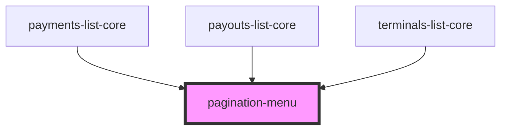

# pagination-menu

<!-- Auto Generated Below -->

## Properties

| Property | Attribute | Description | Type                 | Default                  |
| -------- | --------- | ----------- | -------------------- | ------------------------ |
| `paging` | --        |             | `ExtendedPagingInfo` | `ExtendedPagingDefaults` |
| `params` | --        |             | `{}`                 | `{}`                     |

## Shadow Parts

| Part                 | Description |
| -------------------- | ----------- |
| `"page-arrow"`       |             |
| `"page-button-text"` |             |

## Dependencies

### Used by

 - [payments-list-core](../payments-list)
 - [payouts-list-core](../payouts-list)
 - [terminals-list-core](../terminals-list)

### Graph

----------------------------------------------

*Built with [StencilJS](https://stenciljs.com/)*
