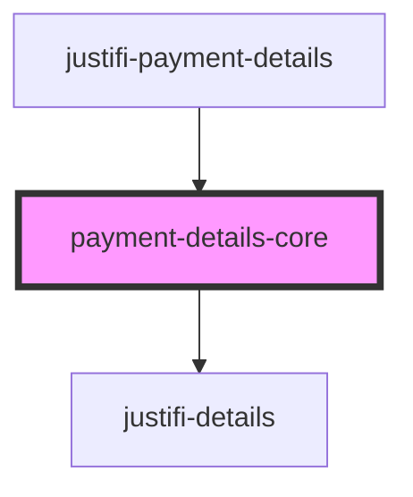

# justifi-payment-details

<!-- Auto Generated Below -->

## Properties

| Property            | Attribute | Description | Type       | Default     |
| ------------------- | --------- | ----------- | ---------- | ----------- |
| `getPaymentDetails` | --        |             | `Function` | `undefined` |

## Events

| Event         | Description | Type                          |
| ------------- | ----------- | ----------------------------- |
| `error-event` |             | `CustomEvent<ComponentError>` |

## Shadow Parts

| Part                  | Description |
| --------------------- | ----------- |
| `"detail-head-badge"` |             |
| `"detail-section"`    |             |

## Dependencies

### Used by

 - [justifi-payment-details](.)

### Depends on

- [justifi-details](../../ui-components/details)

### Graph

----------------------------------------------

*Built with [StencilJS](https://stenciljs.com/)*
