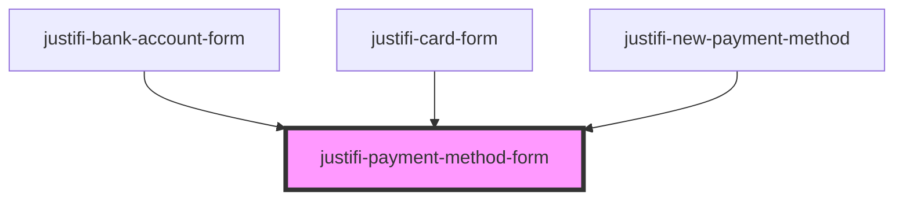

# justifi-payment-method-form

<!-- Auto Generated Below -->

## Properties

| Property                          | Attribute                             | Description | Type                                                                                                                 | Default     |
| --------------------------------- | ------------------------------------- | ----------- | -------------------------------------------------------------------------------------------------------------------- | ----------- |
| `iframeOrigin`                    | `iframe-origin`                       |             | `string`                                                                                                             | `undefined` |
| `paymentMethodFormType`           | `payment-method-form-type`            |             | `PaymentMethodTypes.bankAccount \| PaymentMethodTypes.card \| PaymentMethodTypes.saved \| PaymentMethodTypes.sezzle` | `undefined` |
| `paymentMethodFormValidationMode` | `payment-method-form-validation-mode` |             | `"all" \| "onBlur" \| "onChange" \| "onSubmit" \| "onTouched"`                                                       | `undefined` |
| `singleLine`                      | `single-line`                         |             | `boolean`                                                                                                            | `undefined` |

## Events

| Event                        | Description | Type                                                           |
| ---------------------------- | ----------- | -------------------------------------------------------------- |
| `paymentMethodFormReady`     |             | `CustomEvent<void>`                                            |
| `paymentMethodFormTokenized` |             | `CustomEvent<BankAccountCreateResponse \| CardCreateResponse>` |
| `paymentMethodFormValidated` |             | `CustomEvent<any>`                                             |

## Methods

### `resize() => Promise<void>`

#### Returns

Type: `Promise<void>`

### `tokenize(clientId: string, paymentMethodMetadata: any, account?: string) => Promise<CreatePaymentMethodResponse>`

#### Parameters

| Name                    | Type     | Description |
| ----------------------- | -------- | ----------- |
| `clientId`              | `string` |             |
| `paymentMethodMetadata` | `any`    |             |
| `account`               | `string` |             |

#### Returns

Type: `Promise<CreatePaymentMethodResponse>`

### `validate() => Promise<any>`

#### Returns

Type: `Promise<any>`

## Dependencies

### Used by

 - [justifi-bank-account-form](../bank-account-form)
 - [justifi-card-form](../card-form)
 - [justifi-new-payment-method](../checkout)

### Graph

----------------------------------------------

*Built with [StencilJS](https://stenciljs.com/)*
