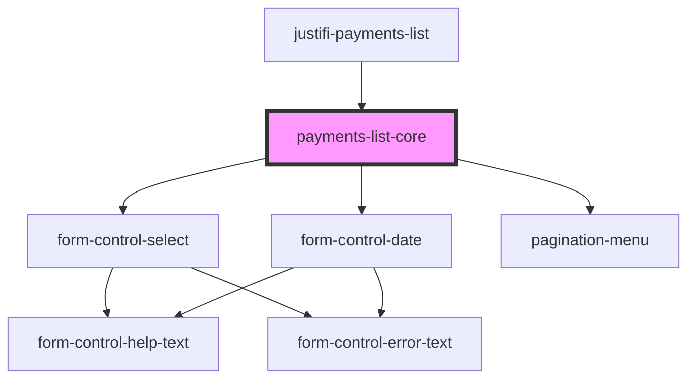

# justifi-payments-list

<!-- Auto Generated Below -->

## Properties

| Property      | Attribute | Description | Type       | Default     |
| ------------- | --------- | ----------- | ---------- | ----------- |
| `getPayments` | --        |             | `Function` | `undefined` |

## Events

| Event                 | Description | Type                          |
| --------------------- | ----------- | ----------------------------- |
| `error-event`         |             | `CustomEvent<ComponentError>` |
| `payment-row-clicked` |             | `CustomEvent<Payment>`        |

## Shadow Parts

| Part                | Description |
| ------------------- | ----------- |
| `"pagination-bar"`  |             |
| `"table-body"`      |             |
| `"table-cell"`      |             |
| `"table-head"`      |             |
| `"table-head-cell"` |             |
| `"table-head-row"`  |             |

## Dependencies

### Used by

 - [justifi-payments-list](.)

### Depends on

- [form-control-select](../form)
- [form-control-date](../form)
- [pagination-menu](../pagination-menu)

### Graph

----------------------------------------------

*Built with [StencilJS](https://stenciljs.com/)*
