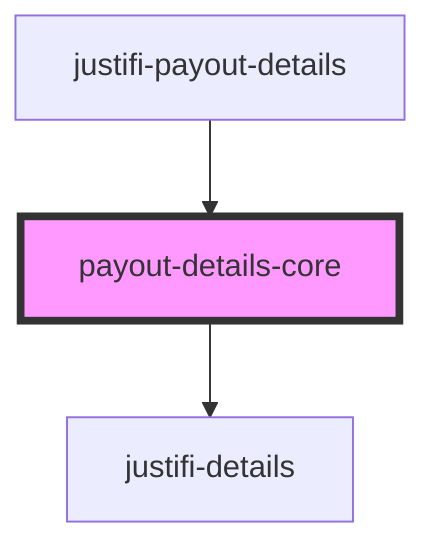

# justifi-payout-details

<!-- Auto Generated Below -->

## Properties

| Property                    | Attribute             | Description | Type       | Default     |
| --------------------------- | --------------------- | ----------- | ---------- | ----------- |
| `enableRecordClick`         | `enable-record-click` |             | `boolean`  | `false`     |
| `getPayout` _(required)_    | --                    |             | `Function` | `undefined` |
| `getPayoutCSV` _(required)_ | --                    |             | `Function` | `undefined` |

## Events

| Event                | Description | Type                               |
| -------------------- | ----------- | ---------------------------------- |
| `error-event`        |             | `CustomEvent<ComponentErrorEvent>` |
| `record-click-event` |             | `CustomEvent<RecordClickEvent>`    |

## Dependencies

### Used by

 - [justifi-payout-details](.)

### Depends on

- [justifi-details](../../ui-components/details)

### Graph

----------------------------------------------

*Built with [StencilJS](https://stenciljs.com/)*
