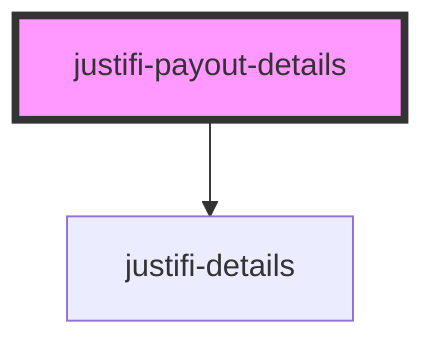

# justifi-payout-details

<!-- Auto Generated Below -->

## Properties

| Property    | Attribute    | Description | Type     | Default     |
| ----------- | ------------ | ----------- | -------- | ----------- |
| `authToken` | `auth-token` |             | `string` | `undefined` |
| `payoutId`  | `payout-id`  |             | `string` | `undefined` |

## Dependencies

### Depends on

- [justifi-details](../details)

### Graph

----------------------------------------------

*Built with [StencilJS](https://stenciljs.com/)*
