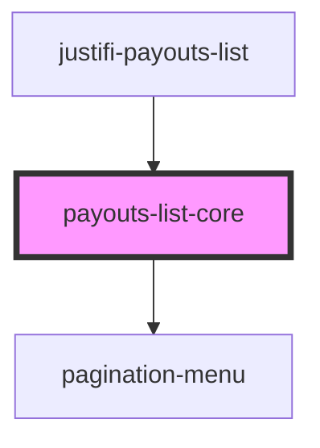

# justifi-payouts-list

<!-- Auto Generated Below -->

## Properties

| Property         | Attribute | Description | Type       | Default     |
| ---------------- | --------- | ----------- | ---------- | ----------- |
| `columns`        | `columns` |             | `string`   | `undefined` |
| `getPayoutCSV`   | --        |             | `Function` | `undefined` |
| `getPayouts`     | --        |             | `Function` | `undefined` |
| `getSubAccounts` | --        |             | `Function` | `undefined` |

## Events

| Event         | Description | Type                               |
| ------------- | ----------- | ---------------------------------- |
| `click-event` |             | `CustomEvent<ComponentClickEvent>` |
| `error-event` |             | `CustomEvent<ComponentErrorEvent>` |

## Shadow Parts

| Part               | Description |
| ------------------ | ----------- |
| `"table-head"`     |             |
| `"table-head-row"` |             |
| `"table-wrapper"`  |             |

## Dependencies

### Used by

 - [justifi-payouts-list](.)

### Depends on

- [pagination-menu](../../ui-components/pagination-menu)

### Graph

----------------------------------------------

*Built with [StencilJS](https://stenciljs.com/)*
