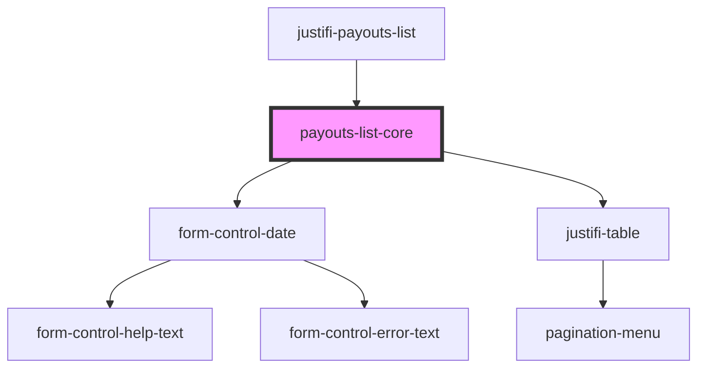

# justifi-payouts-list

<!-- Auto Generated Below -->

## Properties

| Property       | Attribute | Description | Type       | Default     |
| -------------- | --------- | ----------- | ---------- | ----------- |
| `getPayoutCSV` | --        |             | `Function` | `undefined` |
| `getPayouts`   | --        |             | `Function` | `undefined` |

## Events

| Event                | Description | Type                          |
| -------------------- | ----------- | ----------------------------- |
| `error-event`        |             | `CustomEvent<ComponentError>` |
| `payout-row-clicked` |             | `CustomEvent<Payout>`         |

## Dependencies

### Used by

 - [justifi-payouts-list](.)

### Depends on

- [form-control-date](../form)
- [justifi-table](../table)

### Graph

----------------------------------------------

*Built with [StencilJS](https://stenciljs.com/)*
