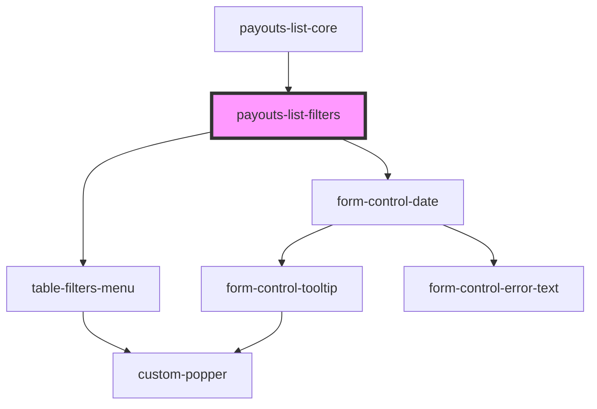

# justifi-payouts-list

<!-- Auto Generated Below -->

## Properties

| Property            | Attribute | Description | Type                                    | Default     |
| ------------------- | --------- | ----------- | --------------------------------------- | ----------- |
| `clearParams`       | --        |             | `() => void`                            | `undefined` |
| `params`            | --        |             | `PayoutsTableFilterParams`              | `{}`        |
| `setParamsOnChange` | --        |             | `(name: string, value: string) => void` | `undefined` |

## Dependencies

### Used by

 - [payouts-list-core](.)

### Depends on

- [table-filters-menu](../../ui-components/filters)
- [form-control-date](../../ui-components/form)

### Graph

----------------------------------------------

*Built with [StencilJS](https://stenciljs.com/)*
