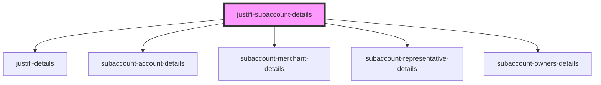

# justifi-subaccount-details

<!-- Auto Generated Below -->

## Properties

| Property       | Attribute       | Description | Type     | Default     |
| -------------- | --------------- | ----------- | -------- | ----------- |
| `accountId`    | `account-id`    |             | `string` | `undefined` |
| `authToken`    | `auth-token`    |             | `string` | `undefined` |
| `subaccountId` | `subaccount-id` |             | `string` | `undefined` |

## Dependencies

### Depends on

- [justifi-details](../details)
- [subaccount-account-details](subaccount-account-details)
- [subaccount-merchant-details](subaccount-merchant-details)
- [subaccount-representative-details](subaccount-representative-details)
- [subaccount-owners-details](subaccount-owners-details)

### Graph

----------------------------------------------

*Built with [StencilJS](https://stenciljs.com/)*
