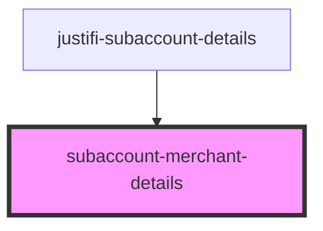

# subaccount-merchant-details

<!-- Auto Generated Below -->

## Properties

| Property         | Attribute | Description | Type              | Default     |
| ---------------- | --------- | ----------- | ----------------- | ----------- |
| `onboardingData` | --        |             | `IOnboardingData` | `undefined` |

## Dependencies

### Used by

 - [justifi-subaccount-details](..)

### Graph

----------------------------------------------

*Built with [StencilJS](https://stenciljs.com/)*
