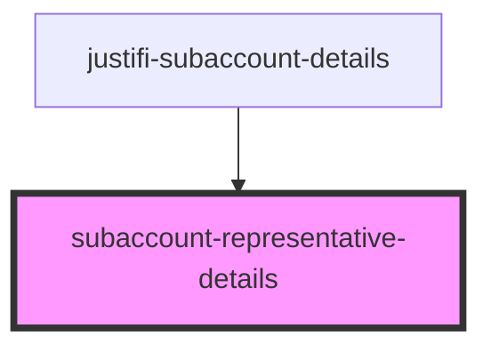

# subaccount-representative-details

<!-- Auto Generated Below -->

## Properties

| Property | Attribute | Description | Type                 | Default     |
| -------- | --------- | ----------- | -------------------- | ----------- |
| `data`   | --        |             | `SubAccountIdentity` | `undefined` |

## Dependencies

### Used by

 - [justifi-subaccount-details](..)

### Graph

----------------------------------------------

*Built with [StencilJS](https://stenciljs.com/)*
