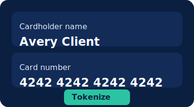

import CodeBlock from '@theme/CodeBlock';

# Overview

`<justifi-tokenize-payment-method>` renders a complete multi-payment form with optional billing fields, submit button, and helper methods for Hosted Checkout integrations. Use this page as the canonical source for the docs sync pipeline.

## When to use it

- Embed a single payment collection form outside of Modular Checkout
- Provide a lightweight tokenization widget for existing payment flows
- Pair with Modular Checkout by hiding the built-in submit button

## Minimum setup

Register the web components bundle once and render the element anywhere in your application. All props map directly to the Stencil component surface.

<CodeBlock language="html">{
`
<justifi-tokenize-payment-method
  account-id="acc_123"
  auth-token="wct_123"
  payment-method-group-id="pmg_default"
></justifi-tokenize-payment-method>`
}</CodeBlock>

## Methods and events

| API | Description |
| --- | --- |
| `tokenizePaymentMethod(event?)` | Returns a `PaymentMethodPayload` with the created token |
| `fillBillingForm(fields)` | Prefills any subset of billing fields to reduce user typing |
| `validate()` | Runs client-side validation without submitting |

## Customization options

- `disableCreditCard`/`disableBankAccount` limit which payment rails are offered
- `hideCardBillingForm`/`hideBankAccountBillingForm` suppress billing sections when already collected elsewhere
- `hideSubmitButton` lets parent flows handle submission
- `submitButtonText` and `savePaymentMethodLabel` tweak visible copy

## Example: externally controlled submit

<CodeBlock language="html">{
`<justifi-tokenize-payment-method
  account-id="acc_demo"
  auth-token="wct_demo"
  hide-submit-button="true"
  save-payment-method-label="Save this payment method"
></justifi-tokenize-payment-method>
<button id="tokenize-submit">Save payment method</button>
`
}</CodeBlock>

## Assets

Use this asset to confirm the docs sync copies images to `/img/web-components/tokenize-payment-method`.

## Related resources

- Modular Checkout docs (coming soon)
- Storybook example: `apps/docs/stories/components/TokenizePaymentMethod`
- API reference: Web Component Tokens API (requires backend integration)
