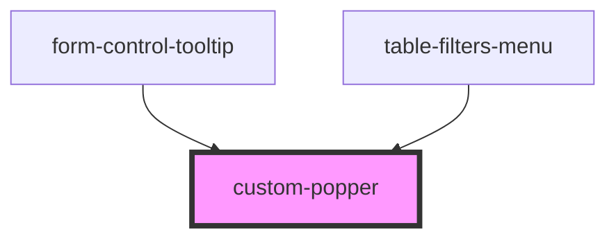

# custom-popper

<!-- Auto Generated Below -->

## Properties

| Property    | Attribute   | Description | Type                                                                                                                                                                                                         | Default      |
| ----------- | ----------- | ----------- | ------------------------------------------------------------------------------------------------------------------------------------------------------------------------------------------------------------ | ------------ |
| `anchorRef` | --          |             | `HTMLElement \| SVGElement`                                                                                                                                                                                  | `undefined`  |
| `offset`    | --          |             | `[number, number]`                                                                                                                                                                                           | `[0, 10]`    |
| `placement` | `placement` |             | `"auto" \| "auto-end" \| "auto-start" \| "bottom" \| "bottom-end" \| "bottom-start" \| "left" \| "left-end" \| "left-start" \| "right" \| "right-end" \| "right-start" \| "top" \| "top-end" \| "top-start"` | `'bottom'`   |
| `strategy`  | `strategy`  |             | `"absolute" \| "fixed"`                                                                                                                                                                                      | `'absolute'` |
| `trigger`   | `trigger`   |             | `string`                                                                                                                                                                                                     | `'click'`    |

## Events

| Event       | Description | Type               |
| ----------- | ----------- | ------------------ |
| `hideEvent` |             | `CustomEvent<any>` |
| `showEvent` |             | `CustomEvent<any>` |

## Dependencies

### Used by

 - [form-control-tooltip](../form/form-helpers/form-control-tooltip)
 - [table-filters-menu](../filters)

### Graph

----------------------------------------------

*Built with [StencilJS](https://stenciljs.com/)*
