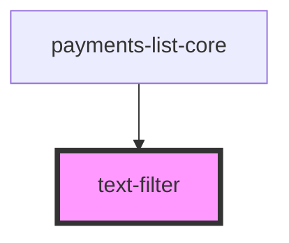

# text-filter

<!-- Auto Generated Below -->

## Properties

| Property      | Attribute     | Description | Type     | Default     |
| ------------- | ------------- | ----------- | -------- | ----------- |
| `label`       | `label`       |             | `string` | `undefined` |
| `name`        | `name`        |             | `string` | `undefined` |
| `params`      | `params`      |             | `any`    | `undefined` |
| `placeholder` | `placeholder` |             | `string` | `undefined` |

## Events

| Event        | Description | Type               |
| ------------ | ----------- | ------------------ |
| `emitParams` |             | `CustomEvent<any>` |

## Shadow Parts

| Part      | Description |
| --------- | ----------- |
| `"input"` |             |
| `"label"` |             |

## Dependencies

### Used by

 - [payments-list-core](../../components/payments-list)

### Graph

----------------------------------------------

*Built with [StencilJS](https://stenciljs.com/)*
