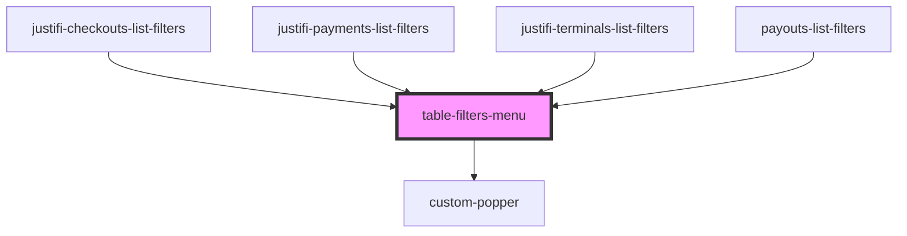

# text-filter

<!-- Auto Generated Below -->

## Properties

| Property      | Attribute | Description | Type         | Default     |
| ------------- | --------- | ----------- | ------------ | ----------- |
| `clearParams` | --        |             | `() => void` | `undefined` |
| `params`      | `params`  |             | `any`        | `undefined` |

## Shadow Parts

| Part              | Description |
| ----------------- | ----------- |
| `"dropdown-menu"` |             |

## Dependencies

### Used by

 - [justifi-checkouts-list-filters](../../components/checkouts-list)
 - [justifi-payments-list-filters](../../components/payments-list)
 - [justifi-terminals-list-filters](../../components/terminals-list)
 - [payouts-list-filters](../../components/payouts-list)

### Depends on

- [custom-popper](../custom-popper)

### Graph

----------------------------------------------

*Built with [StencilJS](https://stenciljs.com/)*
