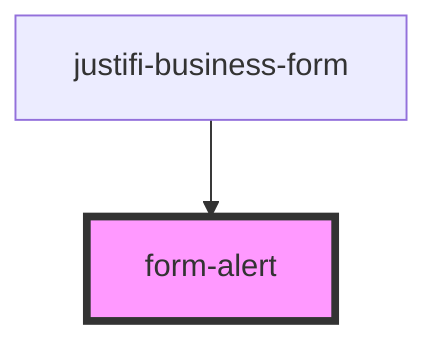

# form-alert

<!-- Auto Generated Below -->

## Properties

| Property    | Attribute    | Description | Type      | Default     |
| ----------- | ------------ | ----------- | --------- | ----------- |
| `hideAlert` | `hide-alert` |             | `boolean` | `undefined` |
| `text`      | `text`       |             | `string`  | `undefined` |

## Dependencies

### Used by

 - [justifi-business-form](../../../../components/business-forms/business-form)

### Graph

----------------------------------------------

*Built with [StencilJS](https://stenciljs.com/)*
