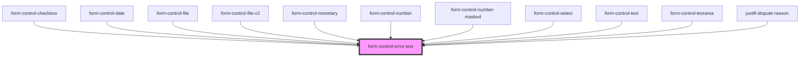

# form-control-error-text

<!-- Auto Generated Below -->

## Properties

| Property    | Attribute    | Description | Type     | Default     |
| ----------- | ------------ | ----------- | -------- | ----------- |
| `errorText` | `error-text` |             | `string` | `undefined` |
| `name`      | `name`       |             | `string` | `undefined` |

## Dependencies

### Used by

 - [form-control-checkbox](../..)
 - [form-control-date](../..)
 - [form-control-file](../..)
 - [form-control-file-v2](../..)
 - [form-control-monetary](../..)
 - [form-control-number](../..)
 - [form-control-number-masked](../..)
 - [form-control-select](../..)
 - [form-control-text](../..)
 - [form-control-textarea](../..)
 - [justifi-dispute-reason](../../../../components/dispute-management/dispute-response)

### Graph

----------------------------------------------

*Built with [StencilJS](https://stenciljs.com/)*
