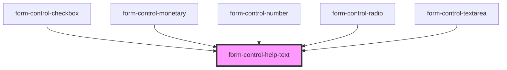

# form-control-help-text

<!-- Auto Generated Below -->

## Properties

| Property   | Attribute   | Description | Type     | Default     |
| ---------- | ----------- | ----------- | -------- | ----------- |
| `helpText` | `help-text` |             | `string` | `undefined` |
| `name`     | `name`      |             | `string` | `undefined` |

## Dependencies

### Used by

 - [form-control-checkbox](../..)
 - [form-control-monetary](../..)
 - [form-control-number](../..)
 - [form-control-radio](../..)
 - [form-control-textarea](../..)

### Graph

----------------------------------------------

*Built with [StencilJS](https://stenciljs.com/)*
