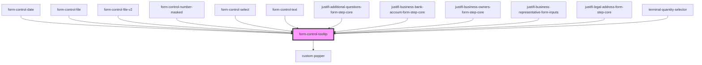

# form-control-tooltip

<!-- Auto Generated Below -->

## Properties

| Property   | Attribute   | Description | Type     | Default     |
| ---------- | ----------- | ----------- | -------- | ----------- |
| `helpText` | `help-text` |             | `string` | `undefined` |

## Dependencies

### Used by

 - [form-control-date](../..)
 - [form-control-file](../..)
 - [form-control-file-v2](../..)
 - [form-control-number-masked](../..)
 - [form-control-select](../..)
 - [form-control-text](../..)
 - [justifi-additional-questions-form-step-core](../../../../components/business-forms/payment-provisioning/additional-questions)
 - [justifi-business-bank-account-form-step-core](../../../../components/business-forms/payment-provisioning/bank-account)
 - [justifi-business-owners-form-step-core](../../../../components/business-forms/payment-provisioning/business-owners)
 - [justifi-business-representative-form-inputs](../../../../components/business-forms/payment-provisioning/business-representative)
 - [justifi-legal-address-form-step-core](../../../../components/business-forms/payment-provisioning/legal-address-form)
 - [terminal-quantity-selector](../../../../components/order-terminals/terminal-quantity-selector)

### Depends on

- [custom-popper](../../../custom-popper)

### Graph

----------------------------------------------

*Built with [StencilJS](https://stenciljs.com/)*
