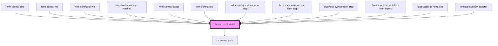

# form-control-tooltip

<!-- Auto Generated Below -->

## Properties

| Property                | Attribute   | Description | Type     | Default     |
| ----------------------- | ----------- | ----------- | -------- | ----------- |
| `helpText` _(required)_ | `help-text` |             | `string` | `undefined` |

## Dependencies

### Used by

 - [form-control-date](../..)
 - [form-control-file](../..)
 - [form-control-file-v2](../..)
 - [form-control-number-masked](../..)
 - [form-control-select](../..)
 - [form-control-text](../..)
 - [additional-questions-form-step](../../../../components/business-forms/payment-provisioning/additional-questions)
 - [business-bank-account-form-step](../../../../components/business-forms/payment-provisioning/bank-account)
 - [business-owners-form-step](../../../../components/business-forms/payment-provisioning/business-owners)
 - [business-representative-form-inputs](../../../../components/business-forms/payment-provisioning/business-representative)
 - [legal-address-form-step](../../../../components/business-forms/payment-provisioning/legal-address-form)
 - [terminal-quantity-selector](../../../../components/order-terminals/terminal-quantity-selector)

### Depends on

- [custom-popper](../../../custom-popper)

### Graph

```mermaid
graph TD;
  form-control-tooltip --> custom-popper
  form-control-date --> form-control-tooltip
  form-control-file --> form-control-tooltip
  form-control-file-v2 --> form-control-tooltip
  form-control-number-masked --> form-control-tooltip
  form-control-select --> form-control-tooltip
  form-control-text --> form-control-tooltip
  additional-questions-form-step --> form-control-tooltip
  business-bank-account-form-step --> form-control-tooltip
  business-owners-form-step --> form-control-tooltip
  business-representative-form-inputs --> form-control-tooltip
  legal-address-form-step --> form-control-tooltip
  terminal-quantity-selector --> form-control-tooltip
  style form-control-tooltip fill:#f9f,stroke:#333,stroke-width:4px
```

----------------------------------------------

*Built with [StencilJS](https://stenciljs.com/)*
