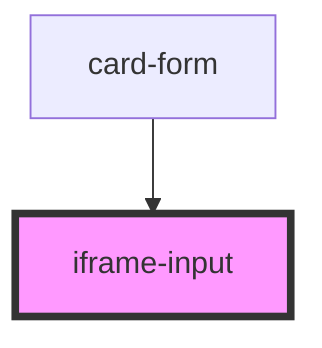

# form-control-text

<!-- Auto Generated Below -->

## Properties

| Property       | Attribute       | Description | Type     | Default     |
| -------------- | --------------- | ----------- | -------- | ----------- |
| `iframeOrigin` | `iframe-origin` |             | `string` | `undefined` |
| `inputId`      | `input-id`      |             | `string` | `undefined` |
| `label`        | `label`         |             | `string` | `undefined` |

## Methods

### `tokenize(clientId: string, paymentMethodMetadata: any, account?: string) => Promise<void>`

#### Parameters

| Name                    | Type     | Description |
| ----------------------- | -------- | ----------- |
| `clientId`              | `string` |             |
| `paymentMethodMetadata` | `any`    |             |
| `account`               | `string` |             |

#### Returns

Type: `Promise<void>`

### `validate() => Promise<any>`

#### Returns

Type: `Promise<any>`

## Shadow Parts

| Part      | Description |
| --------- | ----------- |
| `"label"` |             |

## Dependencies

### Used by

 - [card-form](../../components/checkout/card-form)

### Graph

----------------------------------------------

*Built with [StencilJS](https://stenciljs.com/)*
