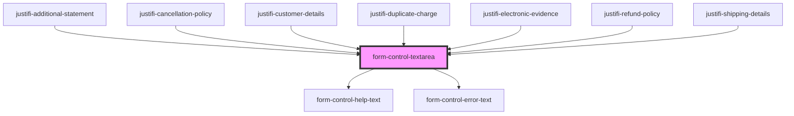

# form-control-text

<!-- Auto Generated Below -->

## Properties

| Property         | Attribute       | Description | Type                                    | Default     |
| ---------------- | --------------- | ----------- | --------------------------------------- | ----------- |
| `defaultValue`   | `default-value` |             | `string`                                | `undefined` |
| `disabled`       | `disabled`      |             | `boolean`                               | `undefined` |
| `errorText`      | `error-text`    |             | `string`                                | `undefined` |
| `helpText`       | `help-text`     |             | `string`                                | `undefined` |
| `inputHandler`   | --              |             | `(name: string, value: string) => void` | `undefined` |
| `keyDownHandler` | --              |             | `(event: any) => void`                  | `undefined` |
| `label`          | `label`         |             | `string`                                | `undefined` |
| `maxLength`      | `max-length`    |             | `number`                                | `undefined` |
| `name`           | `name`          |             | `any`                                   | `undefined` |

## Events

| Event              | Description | Type               |
| ------------------ | ----------- | ------------------ |
| `formControlBlur`  |             | `CustomEvent<any>` |
| `formControlInput` |             | `CustomEvent<any>` |

## Shadow Parts

| Part      | Description |
| --------- | ----------- |
| `"label"` |             |

## Dependencies

### Used by

 - [justifi-additional-questions](../../components/business-forms/business-form/additional-questions)
 - [justifi-additional-questions-form-step-core](../../components/business-forms/payment-provisioning/additional-questions)
 - [justifi-billing-form](../../components/billing-form)
 - [justifi-business-bank-account-form-step](../../components/business-forms/payment-provisioning/bank-account)
 - [justifi-business-core-info](../../components/business-forms/business-form/business-core-info)
 - [justifi-business-core-info-form-step-core](../../components/business-forms/payment-provisioning/business-core-info)
 - [justifi-business-representative](../../components/business-forms/business-form/business-representative)
 - [justifi-business-representative-form-inputs](../../components/business-forms/payment-provisioning/business-representative)
 - [justifi-identity-address-form](../../components/business-forms/owner-form/identity-address)
 - [justifi-legal-address-form](../../components/business-forms/business-form/legal-address-form)
 - [justifi-legal-address-form-step-core](../../components/business-forms/payment-provisioning/legal-address-form)
 - [justifi-refund-form](../../components/refund-form)
 - [owner-form-inputs](../../components/business-forms/owner-form)

### Depends on

- [form-control-help-text](./form-helpers/form-control-help-text)
- [form-control-error-text](./form-helpers/form-control-error-text)

### Graph

----------------------------------------------

*Built with [StencilJS](https://stenciljs.com/)*
